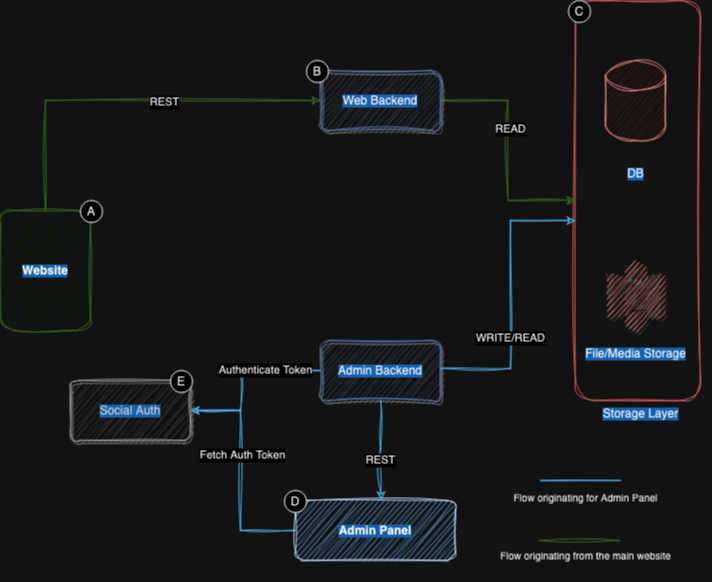

# Blog Website

## Architecture Diagram

### (A) Website

Component is deployed from src to netlify. Netlify then deploys the app to `https://www.yaadata.dev`

### (B) Web Backend

Serverless deno based app that serves only READ requests from the website

### (C) Storage Layer

Storage layer is broken up into two parts

Part A.) Relation Database - Storing correlated data within the website and admin panel. 

Part B.) Document / Media Storage for Blog Content and other pieces of media

### (D) Admin Panel

Currently, the admin panel is an offline UI that allows the author (myself) to create/edit/delete content on the website.

### (E) Social Authentication

Authentication is delegated to sign in to the email of the admin.

